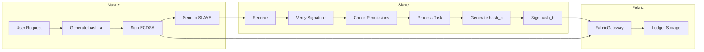
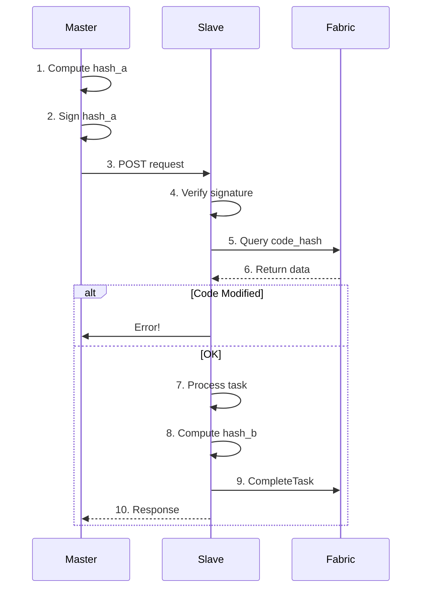
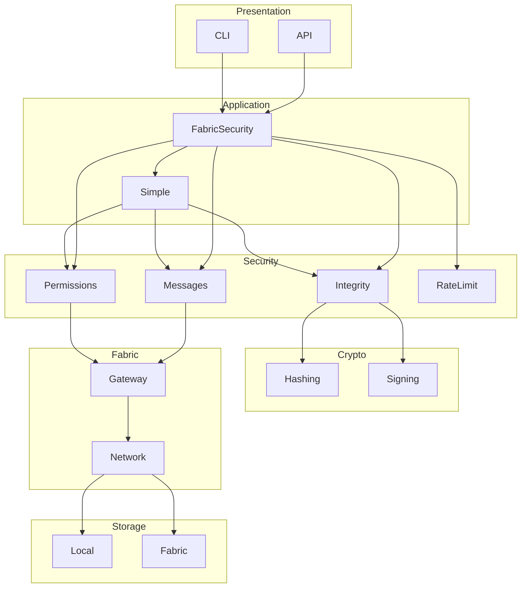
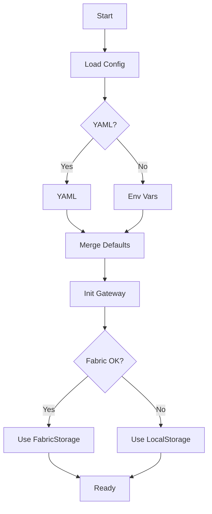
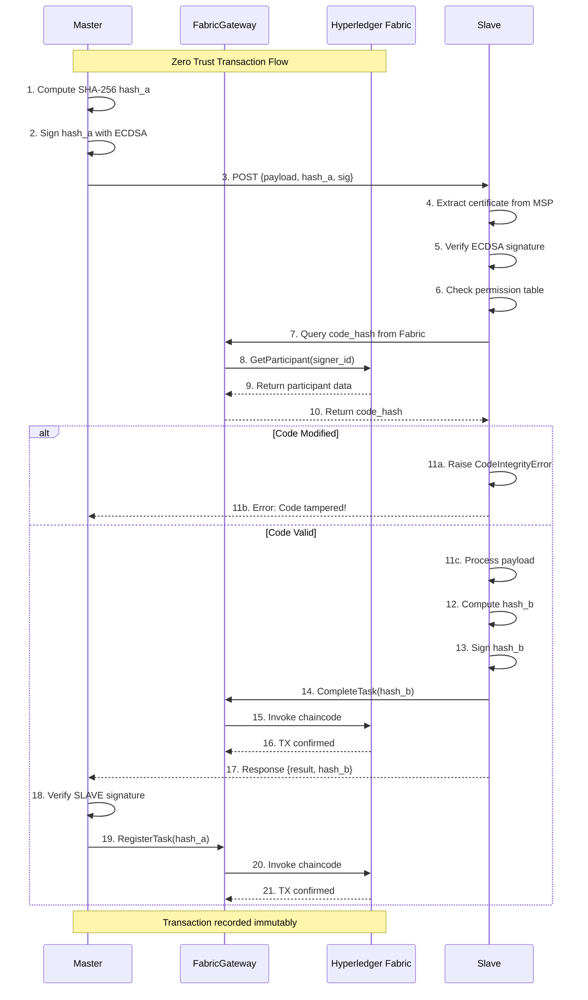
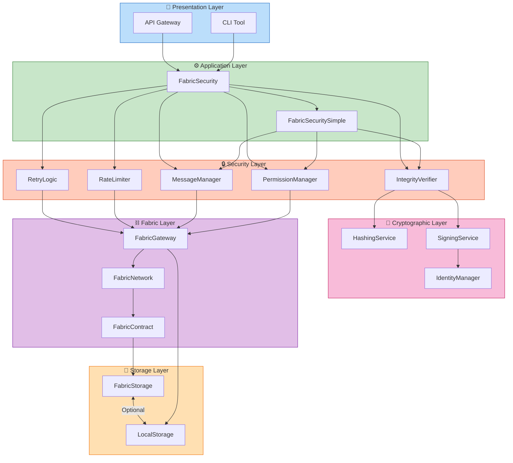
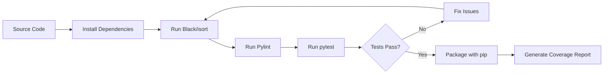
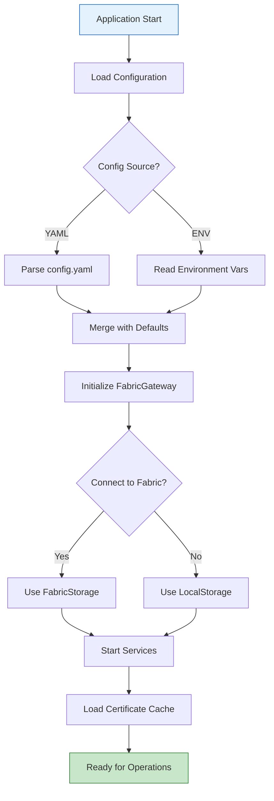
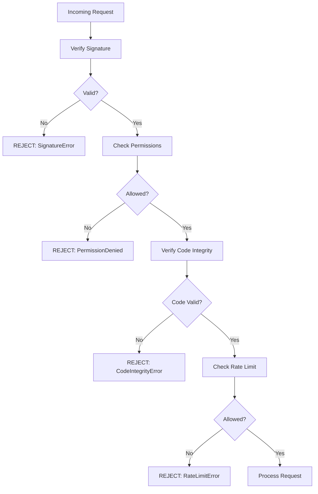

# wFabricSecurity

**Zero Trust Security System for Hyperledger Fabric**


A comprehensive distributed cryptographic security library providing identity verification, code integrity validation, communication permissions, message integrity, rate limiting, retry mechanisms, and immutable audit trails on Hyperledger Fabric blockchain.

---

## Project Overview

**wFabricSecurity** implements a **Zero Trust** security model where no participant is automatically trusted. Every transaction must be cryptographically verified before processing. The system leverages Hyperledger Fabric's immutable ledger to store code hashes, participant registrations, and audit trails.

### Core Philosophy

In a Zero Trust architecture:
- **Never Trust, Always Verify** - Every request must be authenticated and authorized
- **Least Privilege** - Participants only have permissions they explicitly need
- **Assume Breach** - All communications are encrypted and verified

---

## 🚶 Main Process Flow



---

## 🗺️ System Workflow



---

## 🏗️ Architecture



---

## ⚙️ Lifecycle



---
┌─────────────────────────────────────────────────────────────────────────────┐
│                         MASTER Node (Source)                                 │
│  ┌──────────────┐    ┌──────────────┐    ┌──────────────┐    ┌──────────┐ │
│  │ User Request │ -> │ Generate     │ -> │ Sign with    │ -> │ Send to  │ │
│  │              │    │ SHA-256      │    │ ECDSA        │    │ SLAVE    │ │
│  └──────────────┘    │ hash_a       │    │              │    └────┬─────┘ │
│                      └──────────────┘    └──────────────┘         │      │
└───────────────────────────────────────────────────────────────────┼───────┘
                                                                    │
                                                                    ▼
┌─────────────────────────────────────────────────────────────────────────────┐
│                     HYPERLEDGER FABRIC (Ledger)                            │
│  ┌──────────────────┐                      ┌──────────────────────────┐    │
│  │  FabricGateway   │ ◄─────────────────── │    Ledger Storage       │    │
│  │                  │                      │  (Immutable Records)    │    │
│  └──────────────────┘                      └──────────────────────────┘    │
└─────────────────────────────────────────────────────────────────────────────┘
                                                                    ▲
                                                                    │
┌─────────────────────────────────────────────────────────────────────────────┐
│                         SLAVE Node (Processor)                             │
│  ┌──────────────┐    ┌──────────────┐    ┌──────────────┐    ┌──────────┐ │
│  │   Receive    │ -> │   Verify     │ -> │   Check      │ -> │  Process │ │
│  │   Request    │    │   Signature  │    │  Permissions │    │   Task   │ │
│  └──────────────┘    └──────────────┘    └──────────────┘    └────┬─────┘ │
│                                                                    │       │
│                      ┌─────────────────────────────────────────────┘       │
│                      ▼                                                           │
│  ┌──────────────┐    ┌──────────────┐    ┌──────────────┐                   │
│  │  Generate    │ <- │   Sign       │    │  Response    │ ──────────────────┘
│  │  hash_b      │    │   hash_b     │    │  to MASTER   │
│  └──────────────┘    └──────────────┘    └──────────────┘
└─────────────────────────────────────────────────────────────────────────────┘
```

**Flow Description:**
1. MASTER generates SHA-256 hash of payload (hash_a)
2. MASTER signs hash_a with ECDSA private key
3. MASTER sends {payload, hash_a, signature} to SLAVE
4. SLAVE verifies MASTER signature using public certificate
5. SLAVE checks communication permissions
6. SLAVE queries Fabric for registered code hash
7. SLAVE verifies local code matches registered hash
8. SLAVE processes task, generates hash_b, signs it
9. SLAVE stores hash_b in Fabric (CompleteTask)
10. MASTER verifies SLAVE signature, stores hash_a (RegisterTask)

---

## 🗺️ System Workflow - Detailed Sequence

```
┌─────────────────────────────────────────────────────────────────────────────┐
│                          ZERO TRUST TRANSACTION FLOW                         │
└─────────────────────────────────────────────────────────────────────────────┘

MASTER                           SLAVE                            FABRIC
   │                               │                                 │
   │  1. Compute SHA-256 hash_a   │                                 │
   │───────────────────────────────│                                 │
   │                               │                                 │
   │  2. Sign hash_a (ECDSA)       │                                 │
   │───────────────────────────────│                                 │
   │                               │                                 │
   │  3. POST {payload,           │                                 │
   │           hash_a, sig} ─────►│                                 │
   │                               │                                 │
   │                               │  4. Extract cert from MSP      │
   │                               │────────────────────────────────│
   │                               │                                 │
   │                               │  5. Verify ECDSA signature     │
   │                               │────────────────────────────────│
   │                               │                                 │
   │                               │  6. Check permission table     │
   │                               │────────────────────────────────│
   │                               │                                 │
   │                               │  7. Query code_hash ─────────► │
   │                               │                    8. GetParticipant
   │                               │◄────────────────────── 9. Return
   │                               │                                 │
   │                               │ 10. Return code_hash            │
   │                               │────────────────────────────────│
   │                               │                                 │
   │                    ┌──────────┴──────────┐                       │
   │                    │   CODE MODIFIED?   │                       │
   │                    └──────────┬──────────┘                       │
   │                    YES        │        NO                        │
   │                    │          │                                  │
   │     11a. Raise     │          │ 11c. Process payload            │
   │     CodeIntegrityError       │                                  │
   │                    │          │                                  │
   │◄───────────────────┘          │                                  │
   │  11b. Error!                  │ 12. Compute hash_b              │
   │                               │────────────────────────────────│
   │                               │                                 │
   │                               │ 13. Sign hash_b (ECDSA)         │
   │                               │────────────────────────────────│
   │                               │                                 │
   │                               │ 14. CompleteTask(hash_b) ────► │
   │                               │                    15. Invoke  │
   │                               │◄──────────────────── 16. TX OK │
   │                               │                                 │
   │  17. Response {result, ◄──── │                                 │
   │         hash_b, sig}          │                                 │
   │◄─────────────────────────────│                                 │
   │                               │                                 │
   │  18. Verify SLAVE signature   │                                 │
   │───────────────────────────────│                                 │
   │                               │                                 │
   │  19. RegisterTask(hash_a) ───────────────────────────────►     │
   │                                            20. Invoke          │
   │◄──────────────────────────────────────────────────── 21. TX OK │
   │                               │                                 │
   │                    ┌──────────┴──────────┐                       │
   │                    │   IMMUTABLE LEDGER │                       │
   │                    │   RECORD UPDATED    │                       │
   │                    └───────────────────┘                       │
   │                               │                                 │
```

**Transaction recorded immutably in Hyperledger Fabric**

---

## 🏗️ Architecture Components

```
┌─────────────────────────────────────────────────────────────────────────────┐
│                         ARCHITECTURE LAYERS                                 │
└─────────────────────────────────────────────────────────────────────────────┘

┌─────────────────────────────────────────────────────────────────────────────┐
│  📱 PRESENTATION LAYER                                                      │
│  ┌─────────────┐    ┌─────────────┐                                        │
│  │  CLI Tool   │    │ API Gateway │                                        │
│  └──────┬──────┘    └──────┬──────┘                                        │
└─────────┼──────────────────┼────────────────────────────────────────────────┘
          │                  │
          ▼                  ▼
┌─────────────────────────────────────────────────────────────────────────────┐
│  ⚙️ APPLICATION LAYER                                                       │
│  ┌─────────────────────┐    ┌──────────────────────┐                      │
│  │  FabricSecurity     │    │  FabricSecuritySimple │                      │
│  │  (Full Features)    │    │  (Simplified API)     │                      │
│  └──────────┬──────────┘    └───────────┬───────────┘                      │
└─────────────┼───────────────────────────┼────────────────────────────────────┘
              │                           │
              ▼                           ▼
┌─────────────────────────────────────────────────────────────────────────────┐
│  🔒 SECURITY LAYER (Zero Trust Validations)                                 │
│  ┌──────────────┐  ┌──────────────┐  ┌──────────────┐  ┌──────────┐  ┌─────┐│
│  │Integrity     │  │Permission    │  │Message      │  │Rate      │  │Retry││
│  │Verifier      │  │Manager       │  │Manager      │  │Limiter   │  │Logic││
│  │(Code Hash)   │  │(Access Ctrl) │  │(TTL+Sig)    │  │(Token)   │  │(Back ││
│  └──────┬───────┘  └──────┬───────┘  └──────┬───────┘  └────┬────┘  │off)││
└─────────┼──────────────────┼──────────────────┼──────────────┼───────┼────┘
          │                  │                  │              │       │
          ▼                  ▼                  ▼              ▼       ▼
┌─────────────────────────────────────────────────────────────────────────────┐
│  🔐 CRYPTOGRAPHIC LAYER                                                    │
│  ┌──────────────┐    ┌──────────────┐    ┌──────────────┐                   │
│  │ Hashing      │    │ Signing      │    │ Identity     │                   │
│  │ Service      │    │ Service      │    │ Manager      │                   │
│  │(SHA-256,     │    │(ECDSA P-256)│    │(X.509 Certs)│                   │
│  │ BLAKE2)      │    │              │    │              │                   │
│  └──────────────┘    └──────────────┘    └──────────────┘                   │
└─────────────────────────────────────────────────────────────────────────────┘
                                      │
                                      ▼
┌─────────────────────────────────────────────────────────────────────────────┐
│  ⛓️ FABRIC LAYER (Hyperledger Fabric Integration)                           │
│  ┌──────────────┐    ┌──────────────┐    ┌──────────────┐                   │
│  │FabricGateway │───►│ FabricNetwork │───►│FabricContract│                  │
│  │              │    │              │    │              │                   │
│  └──────────────┘    └──────────────┘    └──────┬───────┘                   │
└──────────────────────────────────────────────────┼───────────────────────────┘
                                                   │
                          ┌────────────────────────┴────────────────────────┐
                          ▼                                                 ▼
┌────────────────────────────────────┐          ┌────────────────────────────────┐
│  💾 STORAGE LAYER                  │          │  💾 STORAGE LAYER              │
│  ┌────────────────────────┐         │          │  ┌────────────────────────┐   │
│  │   FabricStorage       │         │          │  │   LocalStorage         │   │
│  │   (Blockchain Backend) │         │◄────────►│  │   (Fallback when       │   │
│  └────────────────────────┘         │          │  │    Fabric unavailable) │   │
└────────────────────────────────────┘          └────────────────────────────────┘
```

---

## ⚙️ Container Lifecycle

### Build Process

```
┌─────────────────────────────────────────────────────────────────────────────┐
│                            BUILD PROCESS                                     │
└─────────────────────────────────────────────────────────────────────────────┘

    ┌──────────────┐
    │ Source Code  │ ◄── git clone
    └──────┬───────┘
           │
           ▼
    ┌──────────────┐
    │   Install    │ ◄── pip install -e .
    │  Dependencies│
    └──────┬───────┘
           │
           ▼
    ┌──────────────┐
    │ Run Format   │ ◄── black, isort
    └──────┬───────┘
           │
           ▼
    ┌──────────────┐
    │ Run Lint     │ ◄── pylint
    └──────┬───────┘
           │
           ▼
    ┌──────────────┐
    │ Run Tests    │ ◄── pytest
    └──────┬───────┘
           │
    ┌──────┴───────┐
    │Tests Pass?   │
    └──┬────────┬──┘
       │        │
      YES       NO
       │        │
       │        ▼
       │  ┌──────────────┐
       │  │  Fix Issues │ ──► (Back to Format)
       │  └──────────────┘
       │
       ▼
┌──────────────────────────────────────┐
│      Package with pip               │ ◄── pip install .
└──────────────────┬─────────────────┘
                   │
                   ▼
         ┌──────────────────┐
         │ Generate Report  │ ◄── pytest --cov
         └──────────────────┘
```

### Runtime Process

```
┌─────────────────────────────────────────────────────────────────────────────┐
│                            RUNTIME PROCESS                                   │
└─────────────────────────────────────────────────────────────────────────────┘

              ┌──────────────────┐
              │ Application Start │
              └────────┬─────────┘
                       │
                       ▼
             ┌──────────────────┐
             │ Load Configuration│
             └────────┬─────────┘
                      │
         ┌────────────┴────────────┐
         │                         │
         ▼                         ▼
┌──────────────────┐    ┌──────────────────┐
│  YAML Config     │    │ Environment Vars │
│  config.yaml     │    │  FABRIC_*        │
└────────┬─────────┘    └────────┬─────────┘
         │                       │
         └───────────┬───────────┘
                     │
                     ▼
           ┌──────────────────┐
           │ Merge with       │
           │ Defaults         │
           └────────┬─────────┘
                    │
                    ▼
          ┌──────────────────┐
          │Initialize       │
          │FabricGateway    │
          └────────┬─────────┘
                   │
       ┌───────────┴───────────┐
       │                       │
       ▼                       ▼
┌──────────────┐       ┌──────────────┐
│ Connect to   │ YES  │ Use          │
│ Fabric?      │─────►│FabricStorage │
└──────┬───────┘      └──────────────┘
       │ NO
       ▼
┌──────────────┐
│ Use          │
│ LocalStorage │
└──────┬───────┘
       │
       └───────────┬───────────┐
                   │           │
                   ▼           ▼
         ┌──────────────┐  ┌──────────────┐
         │Load Cert     │  │Start        │
         │Cache         │  │Services     │
         └──────────────┘  └──────┬───────┘
                                   │
                                   ▼
                          ┌──────────────┐
                          │Ready for    │
                          │Operations   │
                          └─────────────┘
```

---

## 🗺️ System Workflow - Detailed Sequence



---

## 🏗️ Architecture Components



---

## ⚙️ Container Lifecycle

### Build Process



### Runtime Process



---

## 📂 File-by-File Guide

| File/Directory | Purpose |
|----------------|---------|
| `fabric_security.py` | Main classes: FabricSecurity, FabricSecuritySimple |
| `cli.py` | Command-line interface for operations |
| `config/settings.py` | Settings management (YAML + env vars) |
| `config/defaults.py` | Default configuration values |
| `core/exceptions.py` | All 8 security exception types |
| `core/models.py` | Message, Participant, Task data models |
| `core/enums.py` | CommunicationDirection, DataType, etc. |
| `crypto/hashing.py` | SHA-256, BLAKE2 hashing service |
| `crypto/signing.py` | ECDSA signing and verification |
| `crypto/identity.py` | X.509 certificate management with cache |
| `fabric/gateway.py` | Main Fabric blockchain gateway |
| `fabric/network.py` | Fabric network abstraction |
| `fabric/contract.py` | Chaincode function interface |
| `security/integrity.py` | Code hash verification |
| `security/permissions.py` | Communication permission management |
| `security/messages.py` | Message creation with TTL support |
| `security/decorators.py` | @master_audit, @slave_verify |
| `security/rate_limiter.py` | Token bucket rate limiter |
| `security/retry.py` | Exponential backoff retry decorator |
| `storage/local.py` | Local JSON file storage fallback |
| `storage/fabric_storage.py` | Hyperledger Fabric storage backend |
| `test/test_library.py` | 258 unit tests |
| `examples/` | Functional examples (JSON, Image, P2P) |

---

## 🔐 Integrity Validation Matrix

The library implements **10 core integrity validation categories** ensuring complete Zero Trust security. Each validation type ensures specific security properties are maintained.

### Validation Categories Overview

| # | Category | Module | Coverage | Tests |
|---|----------|--------|----------|-------|
| 1 | **Configuration** | `config/` | 94-100% | 12 |
| 2 | **Cryptographic Services** | `crypto/` | 75-91% | 35 |
| 3 | **Code Integrity** | `security/integrity.py` | 78% | 15 |
| 4 | **Digital Signatures** | `crypto/signing.py` | 77% | 20 |
| 5 | **Communication Permissions** | `security/permissions.py` | 89% | 25 |
| 6 | **Message Integrity** | `security/messages.py` | 86% | 30 |
| 7 | **Rate Limiting** | `security/rate_limiter.py` | 88% | 18 |
| 8 | **Retry Logic** | `security/retry.py` | 78% | 20 |
| 9 | **Storage Validation** | `storage/` | 77-95% | 40 |
| 10 | **Fabric Integration** | `fabric/` | 73-95% | 43 |

### Detailed Validation Matrix

#### 1. Code Integrity (78% coverage)
```
Validates source code has not been tampered with
┌────────────────────────────────────────────────────────────┐
│  Code File ──► SHA-256 Hash ──► Store in Fabric          │
│                      │                                    │
│                      ▼                                    │
│  Verification: Compare local hash vs registered hash      │
│                      │                                    │
│              ┌───────┴───────┐                            │
│              │ Match?        │                            │
│         NO───┴──────┐  ┌─────┴───YES                     │
│              │       │  │                                │
│              ▼       │  ▼                                │
│    CodeIntegrity    │  Proceed                           │
│    Error raised     │                                    │
└────────────────────────────────────────────────────────────┘
```

| Test | Description | Status |
|------|-------------|--------|
| `test_hash_computation` | SHA-256 file hashing | ✅ |
| `test_register_code_hash` | Store hash in storage | ✅ |
| `test_verify_code_integrity` | Compare against registered | ✅ |
| `test_multiple_paths_verification` | Batch file verification | ✅ |
| `test_code_modified_detection` | CodeIntegrityError raised | ✅ |

#### 2. Digital Signature Validation (77% coverage)
```
ECDSA P-256 cryptographic signatures
┌────────────────────────────────────────────────────────────┐
│  Data ──► Sign(ECDSA, Private Key) ──► Signature         │
│                      │                                    │
│                      ▼                                    │
│  Verification: Verify(Signature, Public Certificate)       │
│                      │                                    │
│              ┌───────┴───────┐                            │
│              │ Valid?        │                            │
│         NO───┴──────┐  ┌─────┴───YES                     │
│              │       │  │                                │
│              ▼       │  ▼                                │
│    SignatureError   │  Verified                          │
│              │       │                                    │
└────────────────────────────────────────────────────────────┘
```

| Test | Description | Status |
|------|-------------|--------|
| `test_sign_data` | Generate ECDSA signature | ✅ |
| `test_verify_signature` | Verify with public key | ✅ |
| `test_invalid_signature` | SignatureError for invalid | ✅ |
| `test_hmac_fallback` | HMAC when no private key | ✅ |

#### 3. Communication Permissions (89% coverage)
```
Zero Trust access control
┌────────────────────────────────────────────────────────────┐
│  MASTER ──► register_communication ──► SLAVE              │
│                      │                                    │
│                      ▼                                    │
│  Request: Can MASTER send to SLAVE?                       │
│                      │                                    │
│              ┌───────┴───────┐                            │
│              │ Allowed?      │                            │
│         NO───┴──────┐  ┌─────┴───YES                     │
│              │       │  │                                │
│              ▼       │  ▼                                │
│    PermissionDenied  │  Process Request                  │
│    Error            │                                    │
└────────────────────────────────────────────────────────────┘
```

| Direction | Description | Example |
|-----------|-------------|---------|
| OUTBOUND | A can send to B | Master → Slave |
| INBOUND | B can receive from A | Slave ← Master |
| BIDIRECTIONAL | Both directions | Master ↔ Slave |

#### 4. Message Integrity (86% coverage)
```
Hash verification for transmission integrity
┌────────────────────────────────────────────────────────────┐
│  Message Content ──► SHA-256 Hash ──► Signature           │
│                      │                                    │
│                      ▼                                    │
│  Verification: Recompute hash, compare signatures        │
│                      │                                    │
│              ┌───────┴───────┐                            │
│              │ Intact?       │                            │
│         NO───┴──────┐  ┌─────┴───YES                     │
│              │       │  │                                │
│              ▼       │  ▼                                │
│    MessageIntegrity │  Message Valid                     │
│    Error           │                                    │
└────────────────────────────────────────────────────────────┘
```

| Feature | Description |
|---------|-------------|
| TTL Support | Messages expire after configurable time |
| JSON Messages | Automatic serialization |
| Binary Messages | Base64 encoding support |
| Cleanup | Automatic expired message removal |

#### 5. Rate Limiting (88% coverage)
```
Token bucket algorithm for DoS protection
┌────────────────────────────────────────────────────────────┐
│                    Token Bucket                           │
│  ┌──────────────────────────────────────────────────┐   │
│  │  [Token] [Token] [Token] [Token] [Token] ...   │   │
│  │                    │                              │   │
│  │         ┌──────────┴──────────┐                  │   │
│  │         │  Requests arrive    │                  │   │
│  │         └──────────┬──────────┘                  │   │
│  │                    │                             │   │
│  │         ┌─────────┴─────────┐                   │   │
│  │         │ Token available?  │                   │   │
│  │    YES──┴──────┐  ┌─────────┴───NO              │   │
│  │                │  │                             │   │
│  │                ▼  ▼                             │   │
│  │            Blocked                         Allowed│   │
│  └──────────────────────────────────────────────────┘   │
└────────────────────────────────────────────────────────────┘
```

| Parameter | Default | Description |
|-----------|---------|-------------|
| `requests_per_second` | 100 | Token generation rate |
| `burst` | 200 | Max tokens in bucket |

#### 6. Retry Logic (78% coverage)
```
Exponential backoff for transient failures
┌────────────────────────────────────────────────────────────┐
│  Attempt 1 ──► FAIL ──► Wait 0.5s ──► Attempt 2         │
│                                    │                       │
│                                    ▼                       │
│                           FAIL ──► Wait 0.75s ──► Attempt 3│
│                                              │            │
│                                              ▼            │
│                                     FAIL ──► Raise Error   │
└────────────────────────────────────────────────────────────┘
```

| Parameter | Default | Description |
|-----------|---------|-------------|
| `max_attempts` | 3 | Maximum retry attempts |
| `backoff_factor` | 1.5 | Multiplier for delay |
| `initial_delay` | 0.5 | Starting delay in seconds |

#### 7. Storage Validation (77-95% coverage)

| Storage | Coverage | Use Case |
|---------|----------|----------|
| FabricStorage | 77% | Production (blockchain) |
| LocalStorage | 95% | Development/testing |

#### 8. Fabric Integration (73-95% coverage)

| Component | Coverage | Description |
|-----------|----------|-------------|
| FabricGateway | 78% | Main Fabric interface |
| FabricNetwork | 95% | Network configuration |
| FabricContract | 73% | Chaincode interface |

### Zero Trust Validation Flow



### Security Features Summary

| Feature | Description |
|---------|-------------|
| **Code Integrity** | SHA-256 hash verification of source code |
| **ECDSA Signatures** | Elliptic curve cryptography |
| **Communication Permissions** | Fine-grained access control |
| **Message Integrity** | Hash verification for transmissions |
| **Certificate Caching** | LRU cache with TTL |
| **Participant Revocation** | Immediate revocation capability |

### Cryptographic Algorithms

| Service | Algorithm | Standard |
|---------|-----------|---------|
| Hashing | SHA-256, BLAKE2 | FIPS 180-4 |
| Signing | ECDSA P-256 | FIPS 186-4 |
| Certificates | X.509 | RFC 5280 |
| Fallback | HMAC-SHA256 | FIPS 198-1 |

### Test Reports

| Report | Location | Description |
|--------|----------|-------------|
| **Integrity Matrix HTML** | `test/reports/` | Detailed validation report |
| **Coverage HTML** | `htmlcov/index.html` | Line-by-line coverage |

Run `python test/test_report_generator.py` to generate the integrity matrix report. |

---

## Getting Started

### Prerequisites

- Python 3.10 or higher
- Hyperledger Fabric 2.x (optional, for blockchain backend)
- Docker & Docker Compose (for Fabric network)

### Installation

```bash
# Clone the repository
git clone https://github.com/wisrovi/wFabricSecurity.git
cd wFabricSecurity

# Create virtual environment
python -m venv venv
source venv/bin/activate  # Linux/Mac
# venv\Scripts\activate   # Windows

# Install the library
pip install -e .

# Install development dependencies
pip install pylint black isort pytest pytest-cov
```

### Hyperledger Fabric Setup (Optional)

```bash
cd enviroment
make setup    # Generate certificates and artifacts
make up       # Start Docker network
cd ..
```

### Quick Start

```python
from wFabricSecurity import FabricSecurity

# Initialize security system
security = FabricSecurity(
    me="Master",
    msp_path="/path/to/msp"
)

# Register identity and code
security.register_identity()
security.register_code(["master.py"], "1.0.0")

# Register communication permissions
security.register_communication("CN=Master", "CN=Slave")

# Create and verify signed message
message = security.create_message(
    recipient="CN=Slave",
    content='{"operation": "process_data"}'
)

if security.verify_message(message):
    print("✅ Message valid")
```

---

## File Structure

```
wFabricSecurity/
├── wFabricSecurity/                    # Main package
│   ├── __init__.py                    # Public exports
│   └── fabric_security/
│       ├── __init__.py
│       ├── config/                    # Configuration management
│       │   ├── __init__.py
│       │   ├── settings.py            # Settings class (YAML + env vars)
│       │   ├── defaults.py           # Default values
│       │   └── config.yaml          # Example configuration
│       ├── core/                      # Core data structures
│       │   ├── __init__.py
│       │   ├── exceptions.py         # 8 security exceptions
│       │   ├── models.py            # Message, Participant, Task
│       │   └── enums.py             # Enumerations
│       ├── crypto/                    # Cryptographic services
│       │   ├── __init__.py
│       │   ├── hashing.py           # HashingService
│       │   ├── signing.py           # SigningService (ECDSA)
│       │   └── identity.py         # IdentityManager (X.509)
│       ├── fabric/                    # Hyperledger Fabric integration
│       │   ├── __init__.py
│       │   ├── gateway.py          # FabricGateway
│       │   ├── network.py          # FabricNetwork
│       │   └── contract.py         # FabricContract
│       ├── security/                  # Security verification
│       │   ├── __init__.py
│       │   ├── integrity.py        # IntegrityVerifier
│       │   ├── permissions.py      # PermissionManager
│       │   ├── messages.py         # MessageManager (TTL support)
│       │   ├── decorators.py       # @master_audit, @slave_verify
│       │   ├── rate_limiter.py    # RateLimiter (token bucket)
│       │   └── retry.py           # @with_retry decorator
│       ├── storage/                  # Storage backends
│       │   ├── __init__.py
│       │   ├── local.py           # LocalStorage (fallback)
│       │   └── fabric_storage.py   # FabricStorage (blockchain)
│       ├── cli.py                  # Command-line interface
│       └── fabric_security.py      # Main classes
├── test/                             # Library tests (228 tests)
│   ├── __init__.py
│   └── test_library.py
├── examples/                          # Functional examples
│   ├── json/                        # JSON data examples
│   ├── image/                       # Image processing examples
│   ├── p2p/                        # P2P sensitive data examples
│   ├── data/                        # Binary file examples
│   └── test/                       # Example tests
├── enviroment/                       # Hyperledger Fabric setup
│   ├── docker-compose.yaml
│   ├── chaincode/                  # Go chaincode
│   └── organizations/               # MSP certificates
├── .pylintrc                        # Pylint configuration
├── .coveragerc                      # Coverage configuration
└── README.md                        # This file
```

---

## Configuration

### Environment Variables

| Variable | Default | Description |
|----------|---------|-------------|
| `FABRIC_PEER_URL` | `localhost:7051` | Fabric peer gRPC URL |
| `FABRIC_MSP_PATH` | *(auto-detect)* | Path to MSP directory |
| `FABRIC_CHANNEL` | `mychannel` | Fabric channel name |
| `FABRIC_CHAINCODE` | `tasks` | Chaincode name |
| `RATE_LIMIT_RPS` | `100` | Requests per second |
| `RETRY_MAX_ATTEMPTS` | `3` | Max retry attempts |

### config.yaml Example

```yaml
# Local Storage
local_data_dir: /tmp/fabric_security_data

# Fabric Configuration
fabric_channel: mychannel
fabric_chaincode: tasks
fabric_peer_url: localhost:7051

# Retry Settings
retry_max_attempts: 3
retry_backoff_factor: 1.5
retry_initial_delay: 0.5

# Rate Limiting
rate_limit_requests_per_second: 100
rate_limit_burst: 200

# Message Settings
message_ttl_seconds: 3600

# Certificate Cache
cert_cache_size: 100
cert_cache_ttl_seconds: 3600
```

---

## Usage Examples

### Basic Zero Trust System

```python
from wFabricSecurity import FabricSecurity

security = FabricSecurity(
    me="TestUser",
    msp_path="/path/to/msp"
)

# Register your identity and code
security.register_identity()
security.register_code(["master.py"], "1.0.0")

# Create a signed message
message = security.create_message(
    recipient="CN=Slave",
    content='{"task": "process_image", "data": "base64..."}'
)

# Verify received message
if security.verify_message(message):
    print("Message is authentic and unaltered")
```

### Master-Slave Decorators

```python
from wFabricSecurity import FabricSecuritySimple

security = FabricSecuritySimple(me="Master")

# MASTER decorator - sends audited tasks
@security.master_audit(
    task_prefix="TASK",
    trusted_slaves=["CN=Slave1", "CN=Slave2"]
)
def send_to_slave(payload, task_id, hash_a, sig, my_id):
    """This function is automatically signed and audited."""
    return http_post("http://slave/process", payload)

# SLAVE decorator - verifies incoming tasks
@security.slave_verify(trusted_masters=["CN=Master"])
def process_task(payload):
    """Automatically verifies Master's identity and code."""
    return process(payload)
```

### Rate Limiting

```python
from wFabricSecurity import RateLimiter

limiter = RateLimiter(requests_per_second=100, burst=50)

# Acquire token (blocks if unavailable)
limiter.acquire()

# Try acquire (non-blocking)
if limiter.try_acquire():
    process_request()
else:
    raise RateLimitError("Too many requests")
```

### Retry with Exponential Backoff

```python
from wFabricSecurity import with_retry

@with_retry(max_attempts=3, backoff_factor=2.0)
def unreliable_fabric_call():
    """Automatically retries on failure."""
    return fabric_invoke("RegisterTask", args)
```

### Message Expiration

```python
from wFabricSecurity import MessageManager, DataType

manager = MessageManager(gateway, ttl_seconds=3600)

# Create message that expires in 1 hour
msg = manager.create_message(
    sender="CN=Master",
    recipient="CN=Slave",
    content="sensitive_data",
    data_type=DataType.JSON,
    ttl_seconds=3600
)

# Cleanup expired messages
count = manager.cleanup_expired_messages()
```

### Communication Permissions

```python
from wFabricSecurity import PermissionManager

permissions = PermissionManager(gateway)

# Register permission
permissions.register_communication(
    from_identity="CN=Master",
    to_identity="CN=Slave",
    direction=CommunicationDirection.OUTBOUND
)

# Check permission
if permissions.can_communicate_with("CN=Master", "CN=Slave"):
    send_message()
```

---

## Data Types

| Type | Use Case | Format |
|------|----------|--------|
| `JSON` | Structured APIs | `{"key": "value"}` |
| `IMAGE` | Medical imaging, documents | `base64(image_data)` |
| `P2P` | Sensitive data (cards, passwords) | `{"card": "****1234"}` |
| `BINARY` | PDFs, documents, files | `base64(file_data)` |

---

## Exception Handling

```python
from wFabricSecurity import (
    CodeIntegrityError,
    PermissionDeniedError,
    MessageIntegrityError,
    SignatureError,
    RateLimitError,
    RevocationError
)

try:
    security.verify_code(["modified_file.py"])
except CodeIntegrityError:
    print("⚠️ Code has been tampered with!")
except PermissionDeniedError:
    print("🚫 Communication not allowed")
except SignatureError:
    print("❌ Invalid signature")
```

---

## Testing

```bash
# Run library tests
cd examples
make test-core

# Run all tests
make test-all

# Generate HTML report
make report

# View latest report
make view-report
```

### Generating Coverage Report

```bash
# Generate coverage HTML report
python -m pytest test/test_library.py --cov=wFabricSecurity --cov-report=html

# Open coverage report
open htmlcov/index.html
# or
firefox htmlcov/index.html
```

### Test Coverage

| Module | Coverage |
|--------|----------|
| config | 94-100% |
| core | 91-100% |
| crypto | 75-91% |
| fabric | 73-95% |
| security | 78-89% |
| storage | 77-95% |
| **Overall** | **85%** |

### Test Reports

| Report | Location | Description |
|--------|----------|-------------|
| **Coverage HTML** | `htmlcov/index.html` | Detailed line-by-line coverage analysis |
| **Integrity Matrix HTML** | `test/reports/library_test_report_*.html` | 258 tests with integrity validation categories |
| **Test Results** | `test/test_library.py` | 258 unit tests with assertions |

### Generating Test Reports

```bash
# Generate integrity validation matrix report
python test/test_report_generator.py

# Generate coverage report
python -m pytest test/test_library.py --cov=wFabricSecurity --cov-report=html

# Open reports
open test/reports/library_test_report_*.html
open htmlcov/index.html
```

---

## API Reference

### Main Classes

| Class | Description |
|-------|-------------|
| `FabricSecurity` | Full Zero Trust security system |
| `FabricSecuritySimple` | Simplified API for basic use |
| `FabricGateway` | Fabric blockchain gateway |
| `FabricContract` | Chaincode interface |

### Security Classes

| Class | Description |
|-------|-------------|
| `IntegrityVerifier` | Code hash verification |
| `PermissionManager` | Communication permissions |
| `MessageManager` | Message creation and verification |
| `RateLimiter` | Token bucket rate limiting |

### Cryptographic Services

| Class | Description |
|-------|-------------|
| `HashingService` | SHA-256, BLAKE2 hashing |
| `SigningService` | ECDSA/HMAC signing |
| `IdentityManager` | X.509 certificate management |

---

## Contributing

1. Fork the repository
2. Create a feature branch (`git checkout -b feature/amazing-feature`)
3. Commit changes (`git commit -m 'Add amazing feature'`)
4. Push to branch (`git push origin feature/amazing-feature`)
5. Open a Pull Request

### Code Standards

- Follow PEP 8 (enforced with Black)
- Minimum Pylint score: 9.0/10
- All new code requires tests
- Run `isort` and `black` before committing

---

## License

MIT License - see [LICENSE](LICENSE) for details.

---

## Credits

- **Author**: wisrovi
- **Repository**: [github.com/wisrovi/wFabricSecurity](https://github.com/wisrovi/wFabricSecurity)
- **Documentation**: This file serves as the primary documentation

---

## Support

- **Issues**: [GitHub Issues](https://github.com/wisrovi/wFabricSecurity/issues)
- **Discussions**: [GitHub Discussions](https://github.com/wisrovi/wFabricSecurity/discussions)

---

*This README was automatically generated and reflects the current state of the codebase.*
