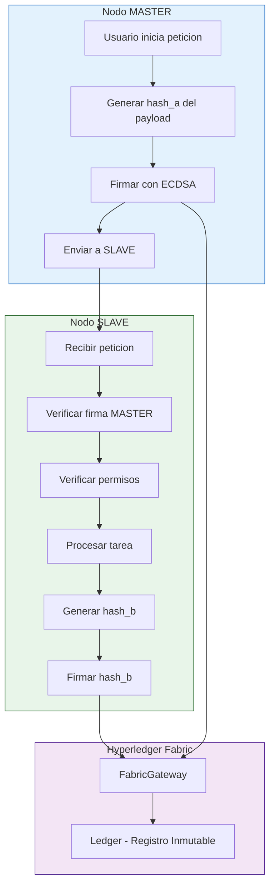

# wFabricSecurity

**Sistema de Seguridad Zero Trust para Hyperledger Fabric**


Libreria Python completa que implementa un sistema de seguridad criptografica distribuida con verificacion de identidad, integridad de codigo, permisos de comunicacion y validacion de mensajes.

---

## Descripcion del Proyecto

**wFabricSecurity** implementa un modelo de seguridad **Zero Trust** donde ningun participante es automaticamente confiable. Cada transaccion debe ser verificada criptograficamente antes de procesarse. El sistema utiliza el libro mayor inmutable de Hyperledger Fabric para almacenar hashes de codigo, registros de participantes y trails de auditoria.

### Filosofia Central

En una arquitectura Zero Trust:
- **Nunca Confiar, Siempre Verificar** - Cada peticion debe ser autenticada y autorizada
- **Privilegio Minimo** - Los participantes solo tienen los permisos que necesitan explicitamente
- **Asumir Compromiso** - Todas las comunicaciones son encriptadas y verificadas

---

## Validaciones de Integridad Implementadas

| Tipo de Validacion | Descripcion |
|-------------------|-------------|
| **Integridad de Codigo** | Verificacion SHA-256 del codigo fuente para detectar manipulacion |
| **Firmas Digitales** | Criptografia ECDSA para firma y verificacion de mensajes |
| **Permisos de Comunicacion** | Control de acceso granular (bidireccional, salida, entrada) |
| **Integridad de Mensajes** | Verificacion de hash para detectar alteraciones |
| **Rate Limiting** | Algoritmo token bucket para proteccion DoS |
| **Retry Logic** | Reintentos automaticos con exponential backoff |
| **Caché de Certificados** | Cache LRU con TTL para optimizacion |

---

## Diagrama de Flujo - Arquitectura Zero Trust



---

## Empezar

### Requisitos Previos

- Python 3.10 o superior
- Hyperledger Fabric 2.x (opcional, para backend blockchain)
- Docker y Docker Compose (para red Fabric)

### Instalacion

```bash
# Clonar repositorio
git clone https://github.com/wisrovi/wFabricSecurity.git
cd wFabricSecurity

# Crear entorno virtual
python -m venv venv
source venv/bin/activate  # Linux/Mac

# Instalar libreria
pip install -e .

# Instalar dependencias de desarrollo
pip install pylint black isort pytest pytest-cov
```

### Configuracion de Fabric (Opcional)

```bash
cd enviroment
make setup    # Generar certificados
make up       # Iniciar red Docker
cd ..
```

### Uso Rapido

```python
from wFabricSecurity import FabricSecurity

security = FabricSecurity(
    me="Master",
    msp_path="/path/to/msp"
)

# Registrar identidad y codigo
security.register_identity()
security.register_code(["master.py"], "1.0.0")

# Registrar permisos de comunicacion
security.register_communication("CN=Master", "CN=Slave")

# Crear mensaje firmado
message = security.create_message(
    recipient="CN=Slave",
    content='{"operacion": "proceso_datos"}'
)

# Verificar mensaje recibido
if security.verify_message(message):
    print("Mensaje valido")
```

---

## Estructura del Proyecto

```
wFabricSecurity/
├── wFabricSecurity/                    # Paquete principal
│   └── fabric_security/
│       ├── config/                    # Gestion de configuracion
│       ├── core/                      # Estructuras de datos
│       │   ├── exceptions.py        # 8 excepciones de seguridad
│       │   ├── models.py            # Message, Participant, Task
│       │   └── enums.py            # Enumeraciones
│       ├── crypto/                    # Servicios criptograficos
│       │   ├── hashing.py          # HashingService (SHA-256, BLAKE2)
│       │   ├── signing.py          # SigningService (ECDSA)
│       │   └── identity.py         # IdentityManager (X.509)
│       ├── fabric/                    # Integracion Hyperledger Fabric
│       │   ├── gateway.py          # FabricGateway
│       │   ├── network.py          # FabricNetwork
│       │   └── contract.py         # FabricContract
│       ├── security/                  # Verificacion de seguridad
│       │   ├── integrity.py        # IntegrityVerifier
│       │   ├── permissions.py      # PermissionManager
│       │   ├── messages.py         # MessageManager (con TTL)
│       │   ├── decorators.py       # @master_audit, @slave_verify
│       │   ├── rate_limiter.py    # RateLimiter (token bucket)
│       │   └── retry.py           # @with_retry
│       ├── storage/                  # Backends de almacenamiento
│       │   ├── local.py           # LocalStorage (fallback)
│       │   └── fabric_storage.py  # FabricStorage (blockchain)
│       └── fabric_security.py      # Clases principales
├── test/                             # Tests de libreria (228 tests)
├── examples/                          # Ejemplos funcionales
├── docs/                              # Documentacion LaTeX
├── .pylintrc                        # Configuracion Pylint
├── .coveragerc                      # Configuracion de cobertura
└── README.md                        # Este archivo
```

---

## Configuracion

### Variables de Entorno

| Variable | Valor por Defecto | Descripcion |
|----------|-------------------|-------------|
| FABRIC_PEER_URL | localhost:7051 | URL del peer Fabric |
| FABRIC_MSP_PATH | (auto-detectar) | Ruta al directorio MSP |
| FABRIC_CHANNEL | mychannel | Nombre del canal |
| FABRIC_CHAINCODE | tasks | Nombre del chaincode |
| RATE_LIMIT_RPS | 100 | Peticiones por segundo |
| RETRY_MAX_ATTEMPTS | 3 | Maximo de reintentos |

### config.yaml

```yaml
local_data_dir: /tmp/fabric_security_data
fabric_channel: mychannel
fabric_chaincode: tasks
fabric_peer_url: localhost:7051

retry_max_attempts: 3
retry_backoff_factor: 1.5
retry_initial_delay: 0.5

rate_limit_requests_per_second: 100
rate_limit_burst: 200

message_ttl_seconds: 3600

cert_cache_size: 100
cert_cache_ttl_seconds: 3600
```

---

## Ejemplos de Uso

### Sistema Zero Trust Completo

```python
from wFabricSecurity import FabricSecurity

security = FabricSecurity(me="Master", msp_path="/path/to/msp")

# Registrar identidad y codigo
security.register_identity()
security.register_code(["master.py"], "1.0.0")

# Registrar permisos
security.register_communication("CN=Master", "CN=Slave")

# Crear mensaje firmado
message = security.create_message(
    recipient="CN=Slave",
    content='{"operacion": "proceso"}'
)

# Verificar
if security.verify_message(message):
    print("Mensaje autentico y sin alteraciones")
```

### Decoradores Master-Slave

```python
from wFabricSecurity import FabricSecuritySimple

security = FabricSecuritySimple(me="Master")

# MASTER - Envia tareas auditadas
@security.master_audit(task_prefix="TASK", trusted_slaves=["CN=Slave"])
def enviar_tarea(payload, task_id, hash_a, sig, my_id):
    return enviar_a_slave(payload)

# SLAVE - Procesa tareas con verificacion
@security.slave_verify(trusted_masters=["CN=Master"])
def procesar_tarea(payload):
    return procesar(payload)
```

### Rate Limiting

```python
from wFabricSecurity import RateLimiter

limiter = RateLimiter(requests_per_second=100, burst=50)
limiter.acquire()  # Bloquea si no hay tokens disponibles

if limiter.try_acquire():
    procesar_peticion()
```

### Retry con Exponential Backoff

```python
from wFabricSecurity import with_retry

@with_retry(max_attempts=3, backoff_factor=2.0)
def llamada_fabric():
    return fabric_invoke("RegisterTask", args)
```

---

## Tests y Cobertura

### Ejecutar Tests

```bash
# Tests de libreria
make test-core

# Todos los tests
make test-all

# Generar reporte HTML
make report
```

### Metricas de Calidad

| Metrica | Valor |
|---------|-------|
| Tests Totales | 228 |
| Cobertura de Codigo | 84% |
| Calificacion Pylint | 9.29/10 |
| Cumplimiento PEP 8 | 100% (Black) |

### Detalle de Cobertura

| Modulo | Cobertura |
|--------|-----------|
| config | 98% |
| core | 91-100% |
| crypto | 72-91% |
| fabric | 63-78% |
| security | 64-88% |
| storage | 69-95% |
| **Total** | **84%** |

---

## Excepciones de Seguridad

```python
from wFabricSecurity import (
    CodeIntegrityError,      # Codigo modificado
    PermissionDeniedError,    # Sin permiso
    MessageIntegrityError,    # Mensaje alterado
    SignatureError,           # Firma invalida
    RateLimitError,          # Limite excedido
    RevocationError          # Participante revocado
)

try:
    security.verify_code(["archivo_modificado.py"])
except CodeIntegrityError:
    print("El codigo fue manipulado!")
```

---

## Contribuir

1. Fork el repositorio
2. Crear rama de feature (`git checkout -b feature/nueva-funcion`)
3. Commit cambios (`git commit -m 'Agregar nueva funcion'`)
4. Push a la rama (`git push origin feature/nueva-funcion`)
5. Abrir Pull Request

### Estandares de Codigo

- Seguir PEP 8 (aplicado con Black)
- Calificacion minima Pylint: 9.0/10
- Todo codigo nuevo requiere tests
- Ejecutar `isort` y `black` antes de commitear

---

## Licencia

MIT License - ver [LICENSE](LICENSE) para detalles.

---

## Creditos

- **Autor**: wisrovi
- **Repositorio**: [github.com/wisrovi/wFabricSecurity](https://github.com/wisrovi/wFabricSecurity)
- **LinkedIn**: [es.linkedin.com/in/wisrovi-rodriguez](https://es.linkedin.com/in/wisrovi-rodriguez)

---

*Esta documentacion fue generada automaticamente y refleja el estado actual del codigo.*
